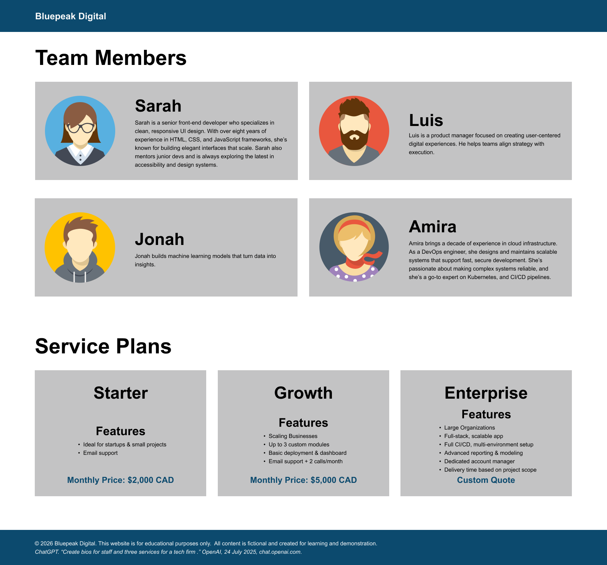

# Nested Flexbox Assessment 10%

This assessment is worth 10% of your overall mark. Demonstrate your understanding of Flexbox layout techniques by building a structured page layout using nested Flexbox containers. You will submit your work via GitHub Classroom, adhering to version control best practices.

## Requirements:

Use the provided HTML markup and follow the Figma file to recreate the fixed-width, desktop layout. The markup is semantic, and you may edit it to add class names and container elements; however, the original document structure must stay the same. Do not remove the semantics or structure of the HTML.

The page does not need to be responsive. Design for a desktop width only.

Flexbox properties to use:&nbsp;
- Display
- Flex-wrap
- Flex-direction
- Justify-content
- Align-items

Use box model properties such as margin and padding to control spacing and layout, rather than using the height property to set a fixed height. This allows elements to naturally adjust to their content, which will be essential for building responsive layouts in the future.

No use of CSS Grid, positioning properties, or frameworks is allowed.

Include comments in your CSS to explain at least 3 Flexbox choices.

## Build Instructions:

### Utilities
Use a CSS reset file along with a separate developer stylesheet. Set a font family on the body element so it’s inherited by all text. Style all headings using the font properties shown in the Figma design panel. Wrap all content in a fixed-width container with a maximum width of 1528px (note: background colours extend the container).
&nbsp;
### Header
Has a full-width background colour with a fixed-width container for the h1 element.

### Main
Team Members has a 4-column layout that wraps to two lines, and the Service Plans area has a 3-column layout.

Each column uses Flexbox for its internal layout. Since each column contains a different amount of content, use Flexbox alignment properties to handle the leftover space on the cross and main axes. Reminder: when the flex direction is changed, the axes change as well.

### Footer
Also has a full-width background colour with a fixed-width container for the paragraph and cite elements.

## Submission:

Note: &nbsp;Ensure the required CSS comments have been included. See requirements above.

Push the completed assessment to the GitHub classroom before the due date. Late pushes will be counted as late submissions and will not be accepted unless prior arrangements are made.

## Preview
